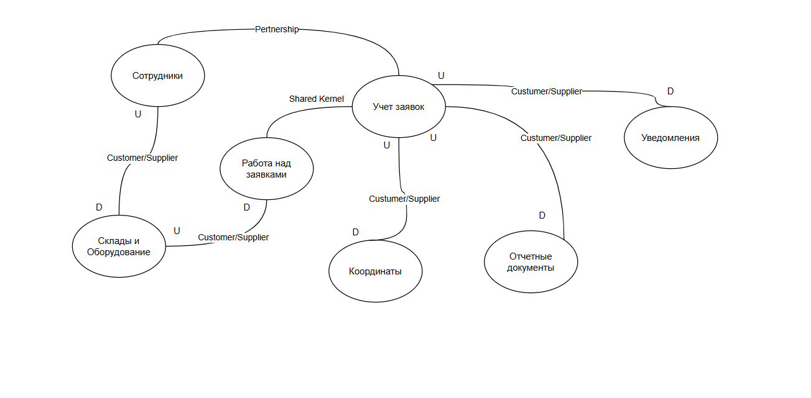

# Система Спирит - система управления разъездными сотрудниками

## 1. Выбор и анализ домена
Домен "Система управления разъездными сотрудниками"

## 2. Список поддоменов

| ПодДомен | Тип | Обоснование |
| :--- | :--- | :--- |
| Заявки| Core | Организация процесса работы над заявками является фактором эффективности работы сотрудников компании. Как заявки учитываются, отслеживаются в системе. Как описывается в формализованном виде процесс работы над заявкой. Все эти данные определяют выполнение компанией своей ключевой функции - выполнение заявок|
| Координаты| Core | Сбор о обработка координат так-же являются зафиксированной обязанностью системы. Собранные координаты используются для определения эффективности работы сотрудников и для оптимизации их работы. Координаты используются для вычисления компенсаций исполнителям за проезд на автомобиле или общественном транспорте|
| Сотрудники| Supporting | Заведение новых сотрудников выполняется в другой системе. Учетные данные сотрудников передаются с Спирит по интеграции из другой системы. Система Спирит отслеживает статусы своих сотрудников. Сотрудник указывает когда он "в смене"/"не в смене"/"на обеде". Это важный поддомен, участвующий в бизнесе компании и поэтому является поддерживающим |
| Оборудование| Supporting | В системе присутствует информация от оборудовании, которое находится на хранении у исполнителей. Исполнители устанавливают или демонтируют оборудование. Исполнители обмениваются оборудованием. Исполнители сдают на склады и забирают оборудование со складов. Часть информации об оборудовании, необходимая для выполнения операций исполнителями хранится в системе. Однако мастер системой для хранения данных об оборудовании является другая система. Поэтому данный поддомен является важным поддерживающим для выполнения основных функций системы Спирит|
| Уведомления| Generic | Подсистема уведомлений используется для сообщения исполнителям важной информации по заявкам. Для отправки уведомлений используются стандартные механизмы уведомлений, поэтому данный домен является общим |
| Отчетные документы| Supporting | Отчётные документы - это поддерживающий домен. Компания обязана предоставить отчётные документы, такие как например акты о выполненных работах после выполнения заявки. Это важная функция, но она не является ключевой в процессе работы компании |

## 3 Ограниченные контексты
| ПодДомен | Ограниченный контекст|
| :--- | :--- |
| Заявки| Учет заявок |
| Заявки| Работа над заявками |
| Координаты | Координаты |
| Сотрудники | Сотрудники |
| Оборудование | Оборудование |
| Уведомления | Уведомления |
| Отчетные документы | Отчетные документы |

**Трактовка одного понятия в различных ограниченных контекстах**

"Заявка" в ограниченном контексте "Учет заявок" характеризуется как сущность, которая имеет свойства:
- Дата создания
- Статус
- Объект обслуживания
- Назначенный Исполнитель

"Заявка" в ограниченном контексте "Работа над заявками" характеризуется как сущность, которая имеет свойства:
- Сервис и Категория - определяют правила выполнения заявки
- Чек-лист

"Заявка" в ограниченном контексте "Координаты" - это набор координат исполнителя, в процессе работы над заявкой.

"Заявка" в ограниченном контексте "Оборудование" - это список оборудования, которое было установлено или демонтировано в процессе работы над заявкой

"Заявка" в ограниченном контексте "Уведомления" - это набор уведомлений, которые были отправлены пользователю по данной заявке. 

"Заявка" в ограниченном контексте "Отчетные документы" - это набор документов, полученных от исполнителя и сгенерированных по результатам работы над заявкой.

## 4 Карта контекстов

## 5. Единый язык (Ubiquitous Language): Для Core-контекстов "Учет заявок" и "Работа над заявками"
|№| Ограниченный контекст | Термин | Определение в рамках контекста | Недопустимые синонимы |
|:---| :--- | :--- | :--- | :--- |
|1| Учет заявок | Исполнитель или Инженер | Сотрудник компании, который выполняет заявку. Инженер использует для работы мобильное приложение Спирит | Пользователь, Сотрудник|
|2| Учет заявок | Менеджер | Сотрудник компании, который настраивает правила выполнения заявок. Менеджер работает через Web-приложение Спирит | Пользователь, Сотрудник |
|3| Учет заявок | Заявка | Зарегистрированное с системе запрос на выполнение работ. Имеющее атрибуты: статус, контрольный срок, назначенный исполнитель. ||
|4| Работа над заявками | Заявка | Зарегистрированный запрос на выполнение работ, относящийся к определенному сервису. Заявка имеет атрибут Сервис, к которому она относится. Сервис определяет состав и последовательность работ, которые должен произвести исполнитель в процессе работы над заявкой. Результатом работы над заявкой является заполненный чек-лист. ||
|5| Учет заявок | Объект обслуживания | Географическое место, которое имеет адрес и координаты. Место в котором нужно выполнять работу над заявкой ||
|6| Работа над заявками | Оборудование | Физическая сущность, которая хранится у исполнителя или используется в процессе выполнения заявки. Оборудование может быть установлено или демонтировано ||
|7| Работа над заявками | Серийное Оборудование | Оборудование, которое имеет уникальный идентификатор | Оборудование |
|8| Работа над заявками | Расходные материалы | Оборудование, которое не имеет уникального идентификатора | Оборудование |
|9| Работа над заявками | Вирт. склад | Это виртуальная сущность, обозначающая место хранения, которое находится у исполнителя. Это может быть рюкзак, багажник автомобиля или отдельная персональная полка на складе компании.| склад |
|10| Работа над заявками | Реальный склад | Склад компании, на котором хранятся расходные материалы и оборудование | склад |
|11| Учет заявок | Координаты | Пара значений, содержащих географические координаты: долгота (longitude) и широта (latitude) ||
|12| Учет заявок/Работа над заявками | Закрытие заявки | Перевод заявки в один из финальных статусов "Выполнена" или "Отклонена" ||
|13| Учет заявок | Назначение заявки | Установка атрибута "Исполнитель" для заданной заявки. При этом заявке устанавливается статус "Назначена". ||

